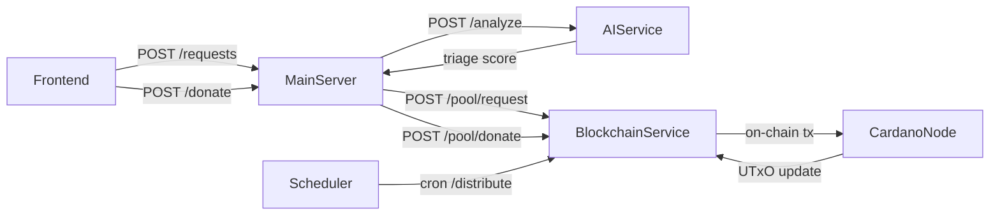

<p align="center">
  
</p>

<p align="center">
  <b>Blockchain Microservice for Donation Pooling & Distribution</b>
</p>

<p align="center">
  <a href="https://nestjs.com"></a>
  <a href="https://cardano.org"></a>
  <a href="https://blockfrost.io/"></a>
</p>

## Description

This microservice manages the blockchain interaction layer for our donation pooling and distribution system built on Cardano. It's responsible for:

1. 🔐 Managing donation pooling via Cardano's UTxO model
2. ⚖️ Handling on-chain logic through Aiken smart contracts
3. 📡 Providing REST API endpoints for the main server to interact with the pool
4. 🔄 Triggering distribution of funds based on voting and triage scores

## Architecture Overview



The BlockchainService (this microservice) works as the off-chain component handling:

- Donation pooling validator (locking UTxOs)
- Distribution trigger (consuming pool UTxO)
- API endpoints for pool interactions

## API Endpoints

| Endpoint           | Method | Description                         |
| ------------------ | ------ | ----------------------------------- |
| `/pool/request`    | POST   | Register a new funding request      |
| `/pool/donate`     | POST   | Record a donation and optional vote |
| `/pool/distribute` | POST   | Trigger a distribution transaction  |

See [API Documentation](#api-documentation) for detailed request/response formats.

## Project Setup

### Prerequisites

- Node.js 18+
- PostgreSQL/MongoDB database
- Blockfrost API key for Cardano testnet/mainnet

```bash
# Install dependencies
$ npm install

# Set up environment variables
$ cp .env.example .env
# Edit .env with your database and Blockfrost credentials
```

## Running the Service

```bash
# Development
$ npm run start

# Watch mode (recommended during development)
$ npm run start:dev

# Production mode
$ npm run start:prod
```

## Testing

```bash
# Unit tests
$ npm run test

# E2E tests (includes Cardano testnet interactions)
$ npm run test:e2e

# Test coverage
$ npm run test:cov
```

## API Documentation

### POST /pool/request

Register a new funding request in the pool service.

**Request Body:**

```json
{
  "request_id": "UUID",
  "hospital_addr": "addr1...",
  "triage_score": 0.85
}
```

**Response:** `201 Created`

### POST /pool/donate

Record a donation and optionally a vote on a specific request.

**Request Body:**

```json
{
  "donation_id": "UUID",
  "donor_addr": "addr1...",
  "ada_amount": 100.0,
  "request_id": "UUID"
}
```

**Response:** `201 Created`

### POST /pool/distribute

Trigger a distribution transaction on-chain.

**Request Body:**

```json
{
  "pool_id": "UUID",
  "interval": 10,
  "percent": 0.2,
  "top_n": 5
}
```

**Response:**

```json
{
  "tx_hash": "hash of the transaction",
  "distributed_amount": 2000.0,
  "recipients": [
    {
      "hospital_addr": "addr1...",
      "amount": 500.0
    },
    ...
  ]
}
```

## Deployment

### Docker

We provide a Docker container for easy deployment:

```bash
# Build the Docker image
$ docker build -t blockchain-microservice .

# Run the container
$ docker run -p 3000:3000 --env-file .env blockchain-microservice
```

### Environment Variables

Set these in your `.env` file before deployment:

```
# Database
DB_TYPE=postgres  # or mongodb
DB_HOST=localhost
DB_PORT=5432
DB_USERNAME=postgres
DB_PASSWORD=password
DB_NAME=donation_pool

# Blockfrost
BLOCKFROST_API_KEY=your_api_key
BLOCKFROST_NETWORK=testnet  # or mainnet

# Service
PORT=3000
NODE_ENV=production
```

## UTxO Flow with Blockfrost

This service uses Blockfrost API to interact with the Cardano blockchain:

### Donation Flow

1. When a donation is received, the service:
   - Retrieves the current pool UTxO at script address
   - Builds a new transaction to update the pool
   - Signs and submits the transaction

```typescript
// Simplified example of processing donation
async function processDonation(donorAddr: string, amount: number) {
  // Get current pool UTxO
  const poolUtxo = await blockfrostApi.addressesUtxosAll(scriptAddress);

  // Build transaction with updated datum
  const tx = await buildDonationTx({
    poolUtxo,
    donorAddr,
    amount,
    newTotal: currentTotal + amount,
  });

  // Sign and submit
  const signedTx = await signTransaction(tx, privateKey);
  return await blockfrostApi.txSubmit(signedTx);
}
```

### Distribution Flow

1. The distribution endpoint:
   - Computes top-N requests by weight
   - Retrieves pool UTxO
   - Creates transaction outputs to recipient hospitals
   - Returns remainder to pool with updated datum

## On-Chain Data Models

This service interacts with the following on-chain data structures:

```typescript
// Datum for the donation pool UTxO
interface PoolDatum {
  poolId: string;
  totalAda: number;
  lastDistribution: number;
  hyperparams: {
    percent: number;
    interval: number;
    topN: number;
  };
}

// Actions that can be performed on the pool
enum PoolAction {
  Donate,
  Distribute,
}
```

## Resources

- [Cardano Documentation](https://docs.cardano.org/)
- [Blockfrost API Reference](https://docs.blockfrost.io/)
- [Aiken Smart Contract Language](https://aiken-lang.org/)
- [NestJS Documentation](https://docs.nestjs.com)

## License

This project is MIT licensed.
