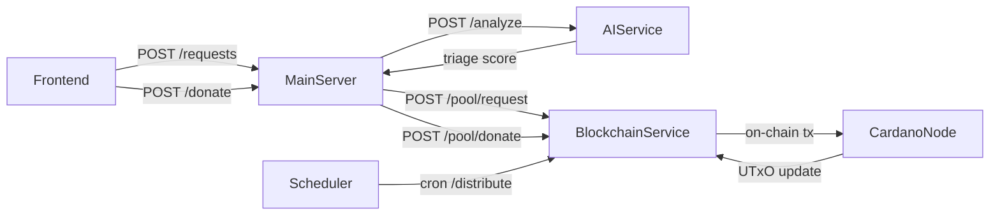

## Blockchain Microservice & On-Chain Logic

This document outlines the design of the blockchain microservice responsible for:

1. Managing donation pooling and distributions via Cardano’s UTxO model and Aiken contracts.
2. Providing REST API endpoints for the main server to interact with the pool and trigger on-chain actions.

---

### 1. Architecture Overview



- **BlockchainService**: Off-chain component handling:

  - Donation pooling validator (locking UTxOs)
  - Distribution trigger (consuming pool UTxO)
  - API for pool interactions

---

### 2. Data Models & Persistence

Stored off-chain in PostgreSQL/MongoDB:

| Entity           | Fields                                                  |
| ---------------- | ------------------------------------------------------- |
| **Pool**         | pool_id, total_ada, last_distribution, hyperparams      |
| **Request**      | request_id, hospital_addr, triage_score, timestamp      |
| **Donation**     | donation_id, request_id (nullable), donor_addr, ada_amt |
| **VoteWeight**   | request_id, ai_weight, donor_weight, total_weight       |
| **Distribution** | distribution_id, interval, percent_pool, recipients\[]  |

---

### 3. REST API Endpoints

#### 3.1 POST /pool/request

_Host: /pool/request_

- **Description**: Register a new funding request in the pool service.
- **Body**:

  ```json
  {
    "request_id": "UUID",
    "hospital_addr": "addr1...",
    "triage_score": 0.0
  }
  ```

- **Response**: `201 Created`

#### 3.2 POST /pool/donate

- **Description**: Record a donation and optionally a vote on a specific request.
- **Body**:

  ```json
  {
    "donation_id": "UUID",
    "donor_addr": "addr1...",
    "ada_amount": 100.0,
    "request_id": "UUID"
  }
  ```

- **Response**: `201 Created`

#### 3.3 POST /pool/distribute

- **Description**: Trigger a distribution transaction on-chain.
- **Body**:

  ```json
  {
    "pool_id": "UUID",
    "interval": 10,
    "percent": 0.2,
    "top_n": 5
  }
  ```

- **Response**: JSON with transaction hash

---

### 4. On-Chain Datums & Redeemers (Aiken)

```haskell
-- Datum for the donation pool UTxO
pub struct PoolDatum:
  pool_id: ByteArray
  total_ada: Int
  last_dist: Int
  hyperparams: HyperParams

pub struct HyperParams:
  percent: Int
  interval: Int
  top_n: Int

-- Redeemer actions
pub enum PoolAction:
  | Donate (donor: ByteArray, amount: Int, req_id: ByteArray)
  | Distribute (results: [(ByteArray, Int)])
```

---

### 5. Aiken Validator Skeletons

```aiken
validator poolValidator(Datum d, Redeemer r, Context ctx) =
  match r:
    Donate donor addr amt req ->
      True

    Distribute results ->
      let total = foldl (\acc (_, a) -> acc + a) 0 results
      in total == (d.total_ada * d.hyperparams.percent / 100)
```

---

### 6. UTxO Flow with Blockfrost

#### Setup

- Use Blockfrost API to interact with Cardano mainnet/testnet.
- Store Blockfrost API key and network identifier securely.

#### 6.1 Pool Initialization

- Send ADA to script address with initial `PoolDatum`.
- Use `blockfrost_api.tx_submit` to push the signed transaction.

#### 6.2 Donation Flow

1. Retrieve current pool UTxO at script address:

   - `GET /addresses/{script_address}/utxos`

2. Build a new transaction:

   - Consume previous pool UTxO.
   - Output to script with updated `total_ada`.
   - Include metadata tagging the donor and optional request ID.

3. Sign with backend wallet key.
4. Submit via `POST /tx/submit`.

#### 6.3 Distribution Flow

1. Triggered by `/pool/distribute` cron.
2. Compute top-N requests by weight.
3. Retrieve pool UTxO.
4. Build transaction:

   - Consume pool UTxO.
   - Create payment outputs to recipient hospitals.
   - Remainder output to script with updated datum.

5. Sign and submit using Blockfrost endpoint.
6. Log transaction hash and update database.

---

### 7. Next Actions

- Finalize Aiken contract logic and test locally.
- Create CLI or SDK wrapper for interacting with Blockfrost.
- Set up retry logic and UTxO watcher for resilience.
- Secure endpoints and perform integration tests across services.
